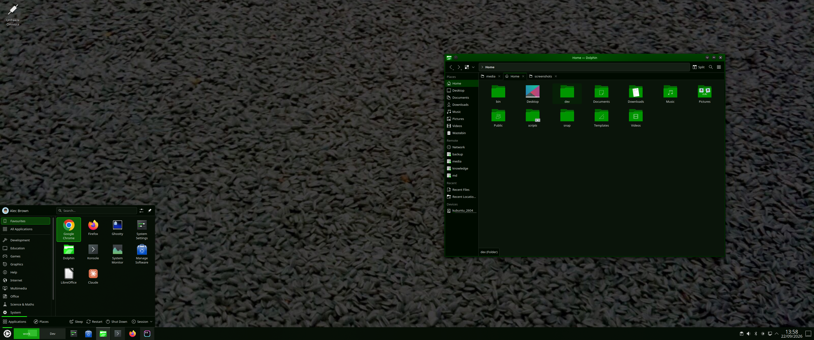

# Phosphor

A dark, high-contrast Plasma 6 global theme: green-on-black, one accent
colour, no gradients or glow. Ships as `Phosphor` in System Settings →
Appearance & Style → Global Theme (and as a standalone `Phosphor` colour
scheme, usable on its own).



## Install

```sh
./install.sh
```

Builds the theme from `palette/phosphor.toml` and installs every
component into `~/.local/share`: the global theme, the Plasma desktop
theme, the desktop wallpaper package, and the `Phosphor` colour scheme.
Safe to re-run — it upgrades existing installs in place.

## Apply

```sh
./apply.sh
```

Applies the theme to your current session: colour scheme, global theme
(icons, cursor, window decoration, splash), desktop wallpaper, and lock
screen wallpaper. Before switching, it backs up whatever theme was
active so it can be undone — see Restore below.

Panels, widgets and shortcuts are never touched (`lookandfeeltool` is
run without `--resetLayout`). A cursor theme change may still need a
full log out/in to apply everywhere.

## Restore

```sh
./apply.sh --restore
```

Undoes the most recent `apply.sh` run: reapplies whichever global theme,
colour scheme and desktop wallpaper were active immediately before
Phosphor was switched to. Safe to run repeatedly.

## Uninstall

```sh
./uninstall.sh
```

Removes every installed component. Does not change your active theme —
run `apply.sh --restore` first if you want your previous look back.

## Palette

All colours are defined once, in `palette/phosphor.toml`.

| Role | Colour |
| --- | --- |
| Ground (window chrome) | `#000A00` |
| Panels / content areas | `#0A140A` |
| Primary accent (focus, active state) | `#1AFF12` |
| Selection background | `#009600` |
| Links | `#009600` |
| Body text | `#E8E8E8` |
| Muted text | `#A0A0A0` |
| Disabled/placeholder text only | `#5A5A5A` |
| Hairlines / separators | `#1C1C1C` |
| Errors | `#FF1414` |
| Warnings | `#FFEA00` |
| Success | `#00B300` |

Body text is ~16:1 contrast against the ground colour, muted text ~7.7:1,
links ~5:1 — all checked automatically by `tools/build.py`, which refuses
to build if any drops below 4.5:1.

## Recommended font

The theme sets **DM Mono** as the fixed-width font. It isn't bundled;
install it separately (e.g. `fonts-dm-mono` on Debian/Ubuntu-based
distros) for the intended look. If it isn't found, the theme falls back
to whatever fixed-width font you already have set.

## What's included

- Global theme (`Plasma/LookAndFeel`, id `com.a1ecbr0wn.phosphor`) — colour
  scheme, icon theme (stock Breeze, recoloured), cursor (stock Breeze),
  window decoration (Oxygen, falls back to Breeze if not installed), an
  original splash screen, fixed-width font
- Standalone `Phosphor` colour scheme
- Plasma desktop theme (panel/popup recolouring, falls back to the
  default Plasma theme for anything not overridden)
- Desktop wallpaper: an original photograph
- Lock screen wallpaper: a different original photograph, set
  independently since KDE has no packaging mechanism for it — `apply.sh`
  writes it directly to `kscreenlockerrc`

## What's not included (yet)

- Light mode
- Alternate icon or cursor themes
- SDDM login screen and Plymouth boot screen styling — both investigated
  and specced as future phases, not built into this release

## Provenance

| File | Origin |
| --- | --- |
| `palette/phosphor.toml`, `tools/build.py`, `install.sh`, `apply.sh`, `uninstall.sh` | Original, this project |
| `src/look-and-feel/`, `src/desktoptheme/`, `src/wallpaper/` (`metadata.json`, `contents/defaults`, `contents/colors`) | Original, generated by `tools/build.py` from the palette |
| `src/look-and-feel/com.a1ecbr0wn.phosphor/contents/splash/Splash.qml` | Original QML, this project |
| `src/wallpaper/Phosphor/contents/images/*.jpg` (desktop wallpaper) | Original photograph by the author |
| `src/look-and-feel/com.a1ecbr0wn.phosphor/contents/lockscreen/colossus.jpg` (lock screen wallpaper) | Original photograph by the author |

Icons and cursor are the stock Breeze theme, already present on any KDE
install — nothing is bundled or redistributed. Window decoration is the
stock Oxygen package.

## Licence

Scripts, QML and generated configuration: GPL-3.0-or-later, see
[LICENSE](LICENSE). Both wallpaper photographs: CC BY-SA 4.0, see
[LICENSE-artwork](LICENSE-artwork).
